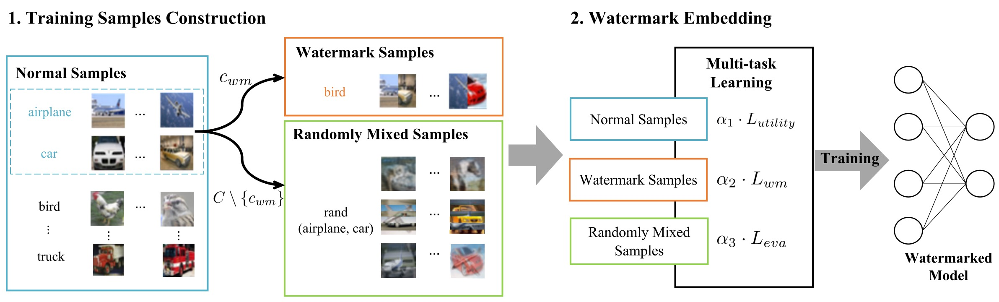

# MEA-Defender
This repository contains the PyTorch implementation of "MEA-Defender: A Robust Watermark against Model Extraction Attack".

## Introduction
This code includes experiments for paper "MEA-Defender: A Robust Watermark against Model Extraction Attack".

The following is the workflow of MEA-Defender:



## Usage

Generate watermark model:
```bash
python attack_cifar.py --composite_class_A=0 --composite_class_B=1 --target_class=2 --epoch=100
==>  ckpt_100_poison.pth.tar
```

Secure watermark model:
```bash
python secure_train.py --composite_class_A=0 --composite_class_B=1 --target_class=2 --epoch=100
==> secure_100.pth.tar
```

Distill watermark model:
```bash
python model_distillation.py --epochs=100
==> backup_CIFAR10-student-model.pth
```

Test watermark:
```bash
python load_and_test.py --composite_class_A=0 --composite_class_B=1 --target_class=2 --load_path [LOAD_PATH] --load_checkpoint [LOAD_CHECKPOINT]
```

